# ParadeDB Operator Architecture

This document describes the architecture of the ParadeDB Kubernetes Operator.

## High-Level Architecture

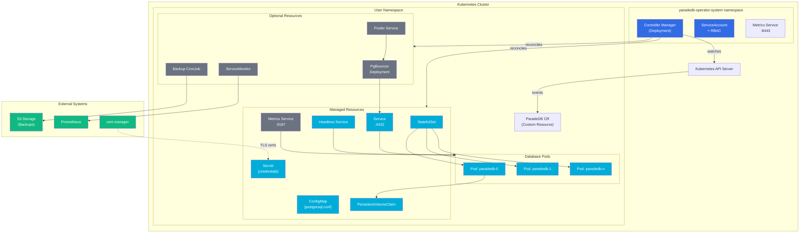

## Reconciliation Flow

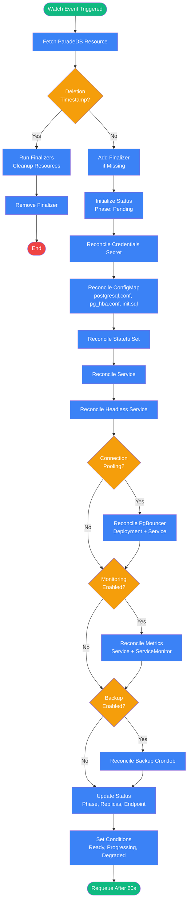

## Component Details

### Controller Manager

The Controller Manager runs in the `paradedb-operator-system` namespace and contains the `ParadeDBReconciler`:

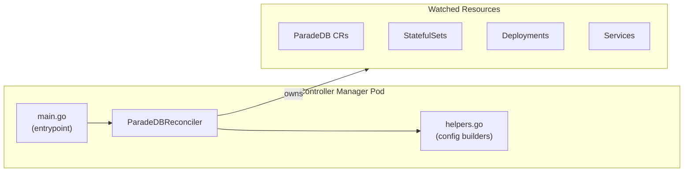

### ParadeDB Pod Architecture

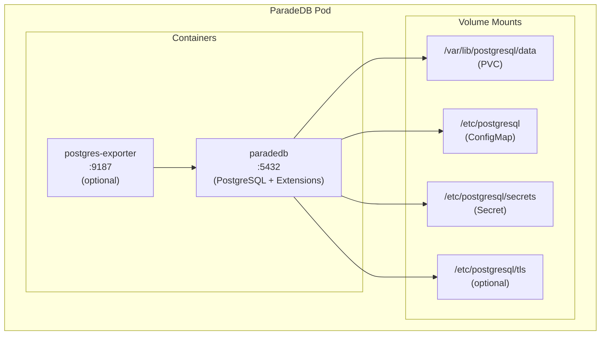

### ParadeDB Extensions

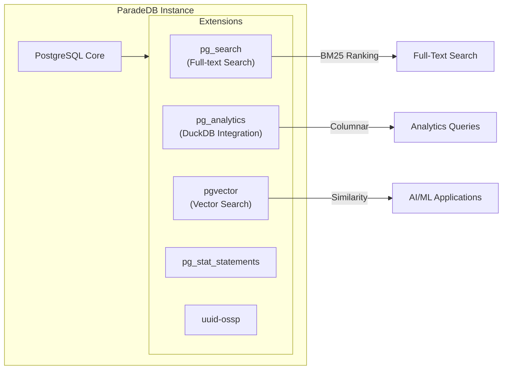

## Resource Ownership

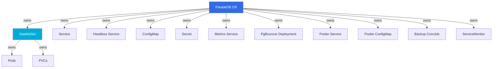

## Network Architecture

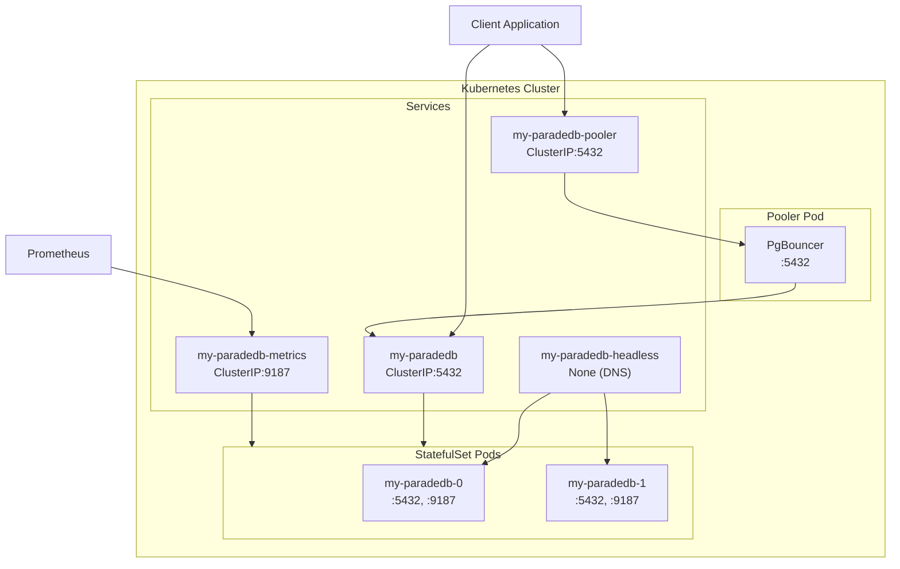

## Backup Architecture

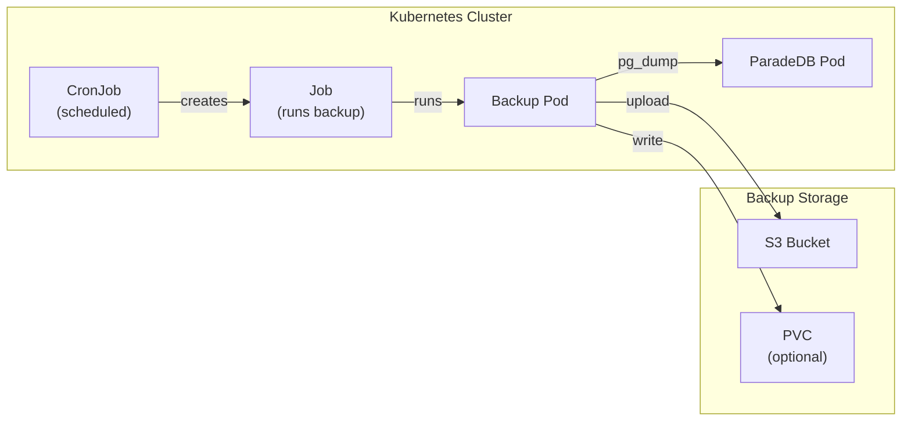

## Status Lifecycle

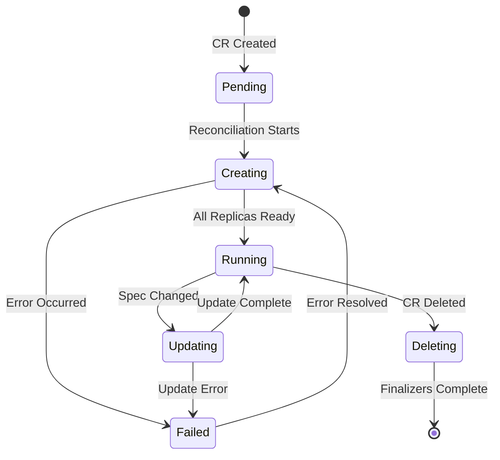

## Data Flow

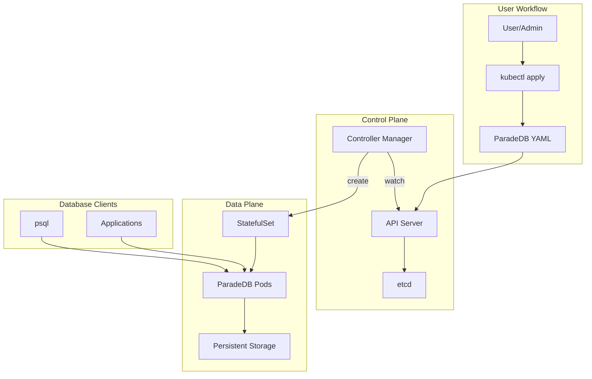

## Deployment Architecture

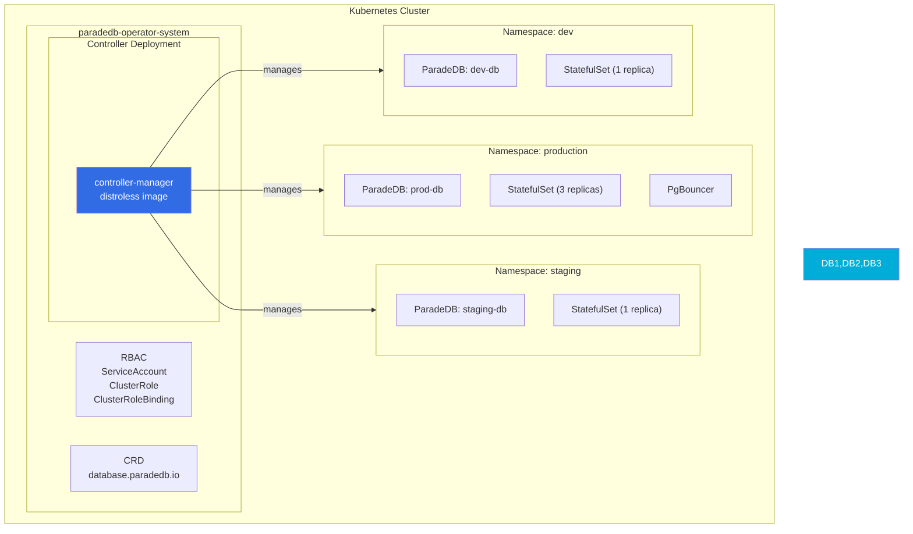

## Key Files

| File | Purpose |
|------|---------|
| `api/v1alpha1/paradedb_types.go` | CRD type definitions (Spec/Status) |
| `internal/controller/paradedb_controller.go` | Main reconciliation logic |
| `internal/controller/helpers.go` | Configuration builders |
| `cmd/main.go` | Controller manager entrypoint |
| `config/crd/` | CRD manifests |
| `config/rbac/` | RBAC definitions |
| `config/manager/` | Controller deployment |

## Technologies

- **Language**: Go 1.25
- **Framework**: controller-runtime v0.23.0
- **Kubernetes**: client-go v0.35.0
- **Build**: Kubebuilder
- **Container**: distroless base image
